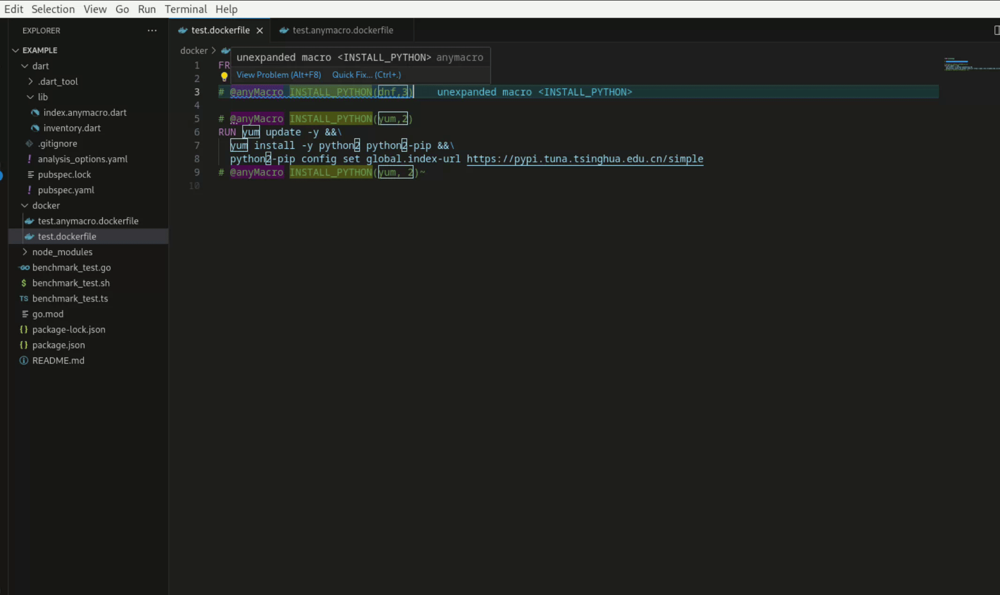
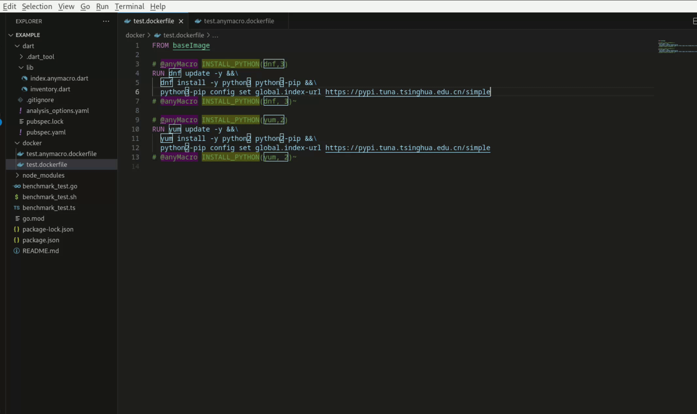
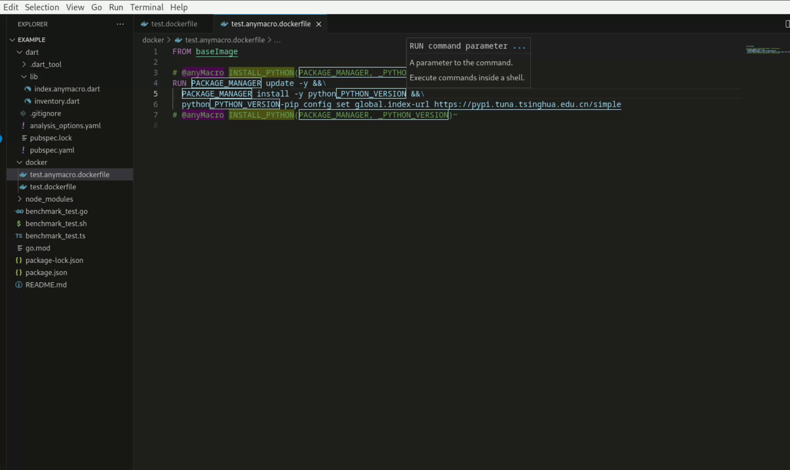
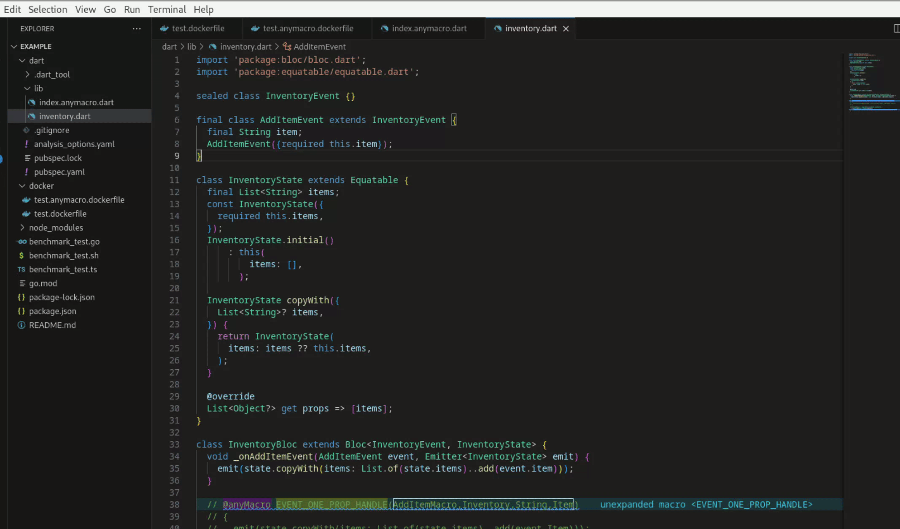

# example

## trigger expansion
use Code Action to trigger macro expand/unexpand


## expansion check
show warning diagnostic when expanded macro not matching defination


## syntax highlight
syntax highlight achived by editor decorations  
**\*color scheme is copied from another vscode extension sample.**  
**\*\*And yes, i know. it's ugly.**


## bloc event
a child class with only one property is a common pattern for a bloc event ,and I'm actively hating it for countless time I have to write boilerplate defination and constructor.


## known issues
>1. when first open a project, macros in current file may show warning message says `"unresolved macro"`.

It's because file searching step happen after first call of diagnostic.(And I haven't found correct event to trigger another diagnose for current opened file.)

>2. when a file with a not currently managed extension name ("\[...\].anymacro.\[new-ext\]") add to work space not recognize by language server. 

It's because none of listeners related to vscode.workdspace is implmented.(Currently only way to re-trigger searching step is do a window reload.)

>3. recursive macros almost always expanded incorrectly and with `"unmatched expansion"` warning.

It's because currently implmention is in a simple search-then-replace way, if required to have a correct diagnosis/expansion for recursive macro,it has to be done by some multi-pass approach (using AST or brutally loop on full document replacement until nothing changed).  
After I do a benchmark base on a code snippet from golang's AST parser,
```
func (s *Scanner) skipWhitespace() {
	for s.ch == ' ' || s.ch == '\t' || s.ch == '\n' && !s.insertSemi || s.ch == '\r' {
		s.next()
	}
}
```
```
=============================================================
goos: linux
goarch: amd64
pkg: example
cpu: Intel(R) Core(TM) i5-1035G4 CPU @ 1.10GHz
BenchmarkCharScanner-8   	1000000000	         0.005019 ns/op
PASS
ok  	example	0.073s
=============================================================
TS char scanner benchmark
one pass through time: 47.787882 ms/op
=============================================================
```
I found comparing to a static typed language TS is really slow in handling string buffer.So, instead of trying to implment this in TypeScript, I'm gonna migrate this project to golang for a better performance.

